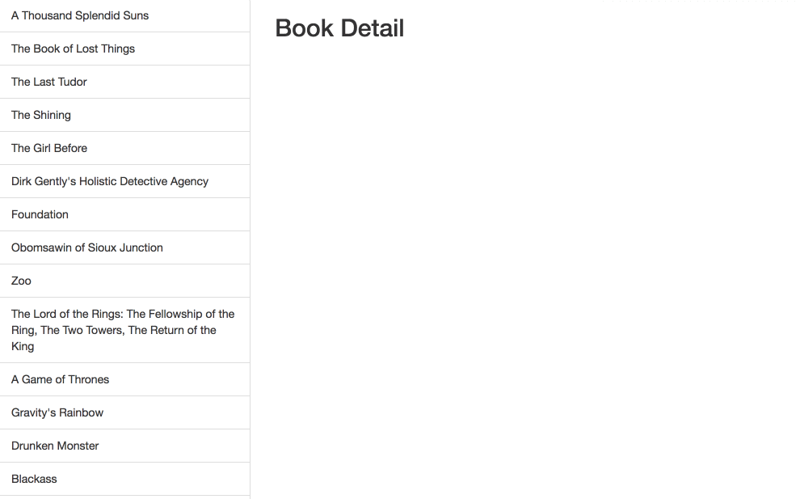

# Module 3 Code Challenge


For this code challenge you will be building out what is called a Master Detail Interface.  This is a very common pattern that you have definitely seen before.

Often, on the side of the screen you will see a list of "all the things", think all of your emails or messages or youtube search results. There will usually be some information about that thing, the email subject and sender for example, but not all of the information that item contains (i.e. not the whole body of the email).

By clicking one particular item in the master list, the application will show more information about that particular item.

## Deliverables



**As a user, when the page loads I should see a list of book titles retrieved from an API on the left hand side of the screen.**

**As a user, when I click a book title, the application should reveal more information about that particular book.**


## Implementation Notes

### The API

Instead of actually accessing the data from a remote API, this challenge uses a package called [json-server](https://github.com/typicode/json-server) to create an fake API for development and testing.

It is very easy to set-up.

1 - Run the command `npm install -g json-server` in the command line from this directory

2 - Run  `json-server --watch db.json`

That's it. You will have a server running on `localhost:3000` that serves the JSON data contained in the `db.json` file.

*Troubleshooting: If this fails, be sure you don't already have something running on port 3000*

The API endpoint we need to retrieve all the books is the conventional RESTful route of `http://localhost:3000/books`

### Styling

[Bootstrap](https://getbootstrap.com/docs/3.3/components/#list-group) is loaded into this project via a link tag in the head of the html. Generally, do not worry about styling in this application.

Though one important point is that for the book titles to show up correctly the html should have the following class names:

```html
<ul class="list-group">
  <li class="list-group-item">Book title 1</li>
  <li class="list-group-item">Book title 2</li>
  /* etc... */
</ul>
```

The book details should be added to this div

```html
<div id="book-detail">

</div>
```

## Considerations

You are free to solve this in any way you choose. It is not required that you have ES6 classes or use Object Orientation. We would recommend beginning with a straightforward functional implementation and refactoring to objects as needed.

jQuery is included in this project, you can choose to use jQuery or vanilla JS.

When you click on an individual `<li>` you will need some of way of determining which particular book was clicked on. How will you solve this problem?
